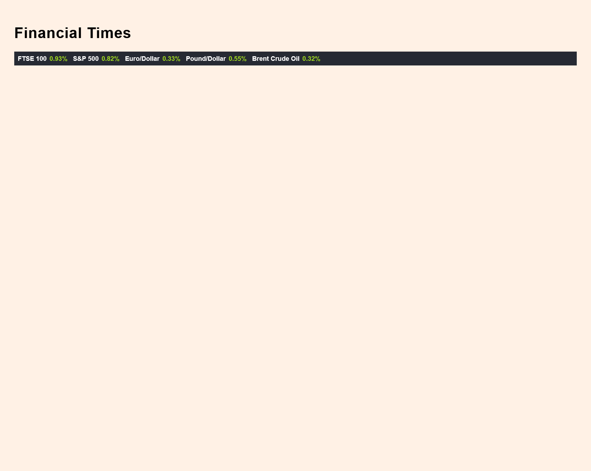

<h1 align="center"><i> FT Specialist Internship Task</i></h1>

**_
The app is developed using HTML, CSS, and JavaScript, without utilizing frameworks and library such as React or Angular. When the app is launched, it displays a page with a title and a container that presents market data information. Initially, all fields are in a loading state, and after a few seconds, the fields will update to display current data or an error message if there was an issue retrieving the data.To start the tests, write npm run test in the terminal. I am using Mocha, Chai, and JSDOM for testing purposes.
_**

<h2 align="center">Unit testing for Data Fetching and HTML Tags Existence - Stack </h2>
- <i><b>Mocha</b></i>
- <i><b>Chai</b></i>
- <i><b>JSDOM</b></i>

<h2 align="center">Error handling</h2>

When an error occurs during data fetching, we display an error message to the user for each field that encountered an error.

  
  
  

